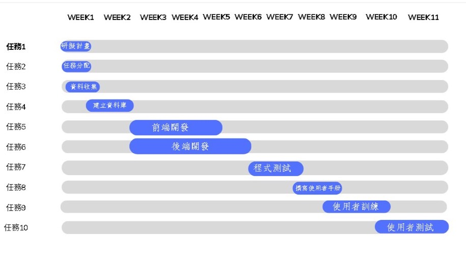
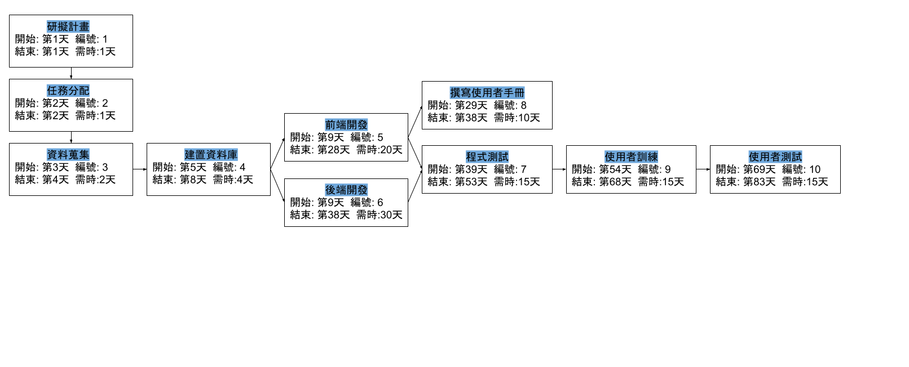

## 分配圖
| 任務 | 說明 | 需時(天) | 前置任務 | 參與人員 |
|:-------|:-------:|:------:|:------:|:------:|
| 1 | 研擬計畫 | 1 | - | All |
| 2 | 任務分配 | 1 | 1 | All |
| 3 | 資料蒐集 | 2 | 2 | All |
| 4 | 建置資料庫 | 4 | 3 | 林琲庭 |
| 5 | 前端開發 | 20 | 4 | 黃琪云、郭宣辰 |
| 6 | 後端開發 | 30 | 4 | 林琲庭 |
| 7 | 程式測試 | 15 | 5、6 | 林琲庭、黃琪云、郭宣辰 |
| 8 | 撰寫使用者手冊 | 10 | 5 | 吳岱融、陳佩萱 |
| 9 | 使用者訓練 | 15 | 7、8 | All |
| 10 | 使用者測試 | 15 | 9 | All |

***
## 甘特圖

***
## PERT圖

***
## 關鍵路徑
1->2->3->4->6->7->9->10

